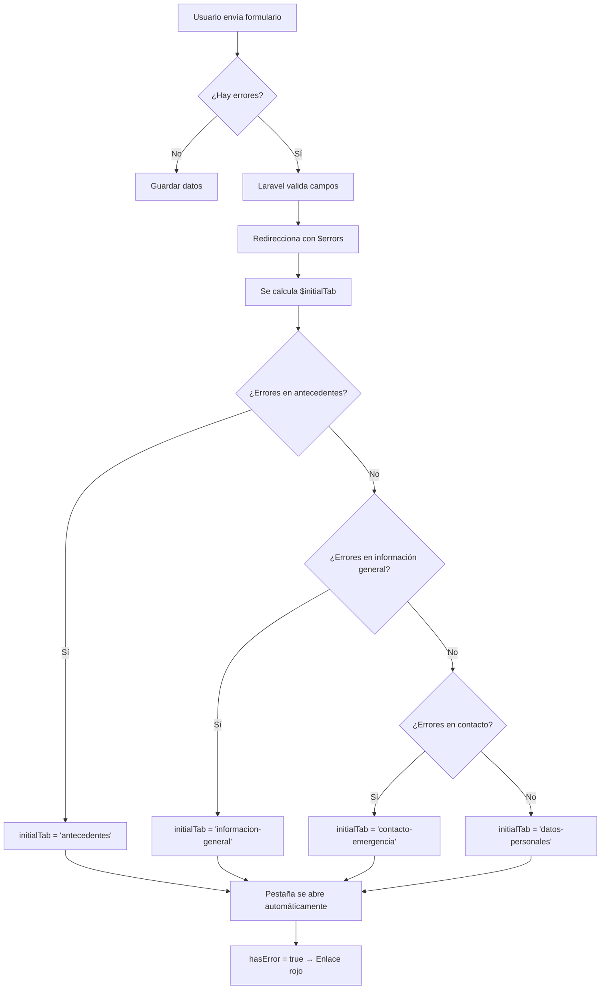

# 📚 Guía de Refactorización DRY para Sistema de Pestañas en Laravel Blade

## 📋 Tabla de Contenidos
1. [Principio DRY](#principio-dry)
2. [Análisis del Problema](#análisis-del-problema)
3. [Componentes Blade Reutilizables](#componentes-blade-reutilizables)
4. [Implementación de Componentes](#implementación-de-componentes)
5. [Integración en Edit.blade.php](#integración-en-editbladephp)
6. [Manejo de Errores de Validación](#manejo-de-errores-de-validación)
7. [Beneficios de la Refactorización](#beneficios-de-la-refactorización)

---

## 1️⃣ Principio DRY

### ¿Qué es DRY?

**DRY** significa **"Don't Repeat Yourself"** (No te repitas a ti mismo). Es un principio fundamental de desarrollo de software que establece:

> **"Cada pieza de conocimiento debe tener una representación única, inequívoca y autoritativa dentro de un sistema."**

### ¿Cómo ayuda a evitar deuda técnica?

| **Aspecto** | **Sin DRY** | **Con DRY** |
|-------------|-------------|-------------|
| **Mantenimiento** | Cambiar algo en 10 lugares | Cambiar en un solo lugar |
| **Bugs** | Error repetido múltiples veces | Fix en un solo componente |
| **Legibilidad** | Código largo y redundante | Código limpio y conciso |
| **Testing** | Probar cada repetición | Probar un componente central |
| **Escalabilidad** | Difícil agregar nuevas pestañas | Fácil reutilización de componentes |

### Ejemplo conceptual

**❌ SIN DRY (Malo):**
```php
// Pestaña 1
<a href="#" class="text-blue-600 border-blue-600...">Tab 1</a>

// Pestaña 2
<a href="#" class="text-blue-600 border-blue-600...">Tab 2</a>

// Pestaña 3
<a href="#" class="text-blue-600 border-blue-600...">Tab 3</a>
```

**✅ CON DRY (Bueno):**
```php
<x-tabs-link tab="tab1" :activeTab="$activeTab">Tab 1</x-tabs-link>
<x-tabs-link tab="tab2" :activeTab="$activeTab">Tab 2</x-tabs-link>
<x-tabs-link tab="tab3" :activeTab="$activeTab">Tab 3</x-tabs-link>
```

---

## 2️⃣ Análisis del Problema

### Código repetido detectado en `edit.blade.php`

#### 🔴 **Problema 1: Lógica de detección de errores duplicada**

En el archivo original, cada pestaña tiene esta lógica repetida:

```php
@php
    $hasErrorAntecedentes = $errors->hasAny($errorGroups['antecedentes']);
@endphp
<a 
    class="... {{ $hasErrorAntecedentes && $initialTab !== 'antecedentes' ? 'text-red-600 border-red-600' : '' }}
    {{ $hasErrorAntecedentes && $initialTab === 'antecedentes' ? 'text-red-600 border-red-600 active' : '' }}
    {{ !$hasErrorAntecedentes && $initialTab === 'antecedentes' ? 'text-blue-600 border-blue-600 active' : '' }}
    {{ !$hasErrorAntecedentes && $initialTab !== 'antecedentes' ? 'text-gray-500 hover:text-blue-600 hover:border-gray-300 border-transparent' : '' }}"
>
```

**Problema:** Esta lógica se repite 3 veces (una por cada pestaña con errores).

#### 🔴 **Problema 2: Clases CSS repetidas**

Cada enlace de pestaña tiene las mismas clases base:

```php
class="inline-flex items-center justify-center p-4 border-b-2 rounded-t-lg transition-colors duration-200"
```

#### 🔴 **Problema 3: Estructura HTML duplicada**

Los contenedores de contenido tienen el mismo patrón:

```html
<div x-show="activeTab === 'nombre-tab'" x-cloak style="display: none;">
    <!-- Contenido aquí -->
</div>
```

### ¿Por qué es mala práctica?

1. **Mantenimiento difícil:** Si cambias el diseño de una pestaña, debes cambiar todas las demás.
2. **Inconsistencias:** Es fácil olvidar actualizar todas las pestañas, generando comportamientos diferentes.
3. **Código verboso:** El archivo crece innecesariamente, haciéndolo difícil de leer.
4. **Violación de Single Responsibility Principle:** El archivo hace demasiadas cosas a la vez.

---

## 3️⃣ Componentes Blade Reutilizables

Para solucionar este problema, crearemos **3 componentes Blade**:

### Estructura de componentes

```
resources/views/components/
├── tabs.blade.php           → Contenedor principal de pestañas
├── tabs-link.blade.php      → Enlace individual de pestaña
└── tabs-content.blade.php   → Contenedor de contenido
```

---

## 4️⃣ Implementación de Componentes

### 🧩 **Componente 1: `tabs.blade.php`**

**Propósito:** Contenedor principal que gestiona el estado de las pestañas con Alpine.js.

**Ubicación:** `resources/views/components/tabs.blade.php`

```blade
@props(['initialTab' => 'tab-1'])

<div x-data="{ activeTab: '{{ $initialTab }}' }">
    {{ $slot }}
</div>

@push('styles')
<style>
    [x-cloak] { display: none !important; }
</style>
@endpush
```

#### 📖 Explicación técnica:

| **Elemento** | **Propósito** |
|--------------|---------------|
| `@props(['initialTab' => 'tab-1'])` | Define las propiedades que acepta el componente. `initialTab` define qué pestaña está activa inicialmente. |
| `x-data="{ activeTab: '...' }"` | Inicializa el estado reactivo de Alpine.js. La variable `activeTab` controla qué pestaña está visible. |
| `{{ $slot }}` | Renderiza todo el contenido que se pase entre las etiquetas del componente. |
| `@push('styles')` | Inyecta CSS en la sección de estilos del layout principal. |
| `[x-cloak]` | Oculta elementos mientras Alpine.js se inicializa, previniendo flashes de contenido. |

---

### 🧩 **Componente 2: `tabs-link.blade.php`**

**Propósito:** Enlace de navegación individual para cada pestaña con estilos dinámicos.

**Ubicación:** `resources/views/components/tabs-link.blade.php`

```blade
@props([
    'tab' => '',
    'activeTab' => '',
    'icon' => '',
    'hasError' => false
])

@php
    // Determinar clases dinámicamente
    $isActive = $activeTab === $tab;
    
    // Clases base (siempre se aplican)
    $baseClasses = 'inline-flex items-center justify-center p-4 border-b-2 rounded-t-lg transition-colors duration-200';
    
    // Lógica de colores según estado
    if ($hasError && $isActive) {
        // Pestaña activa CON error: roja activa
        $stateClasses = 'text-red-600 border-red-600 dark:text-red-500 dark:border-red-500';
    } elseif ($hasError && !$isActive) {
        // Pestaña inactiva CON error: roja sin borde activo
        $stateClasses = 'text-red-600 border-red-600';
    } elseif (!$hasError && $isActive) {
        // Pestaña activa SIN error: azul activa
        $stateClasses = 'text-blue-600 border-blue-600 dark:text-blue-500 dark:border-blue-500 active';
    } else {
        // Pestaña inactiva SIN error: gris con hover
        $stateClasses = 'text-gray-500 hover:text-blue-600 hover:border-gray-300 dark:text-gray-400 dark:hover:text-gray-300 border-transparent';
    }
    
    $allClasses = $baseClasses . ' ' . $stateClasses;
@endphp

<li class="me-2">
    <a 
        href="#" 
        @click.prevent="activeTab = '{{ $tab }}'"
        :class="activeTab === '{{ $tab }}' 
            ? '{{ $hasError ? 'text-red-600 border-red-600' : 'text-blue-600 border-blue-600' }}' 
            : '{{ $hasError ? 'text-red-600 border-red-600' : 'text-gray-500 hover:text-blue-600 hover:border-gray-300 border-transparent' }}'"
        class="{{ $allClasses }}"
    >
        @if($icon)
            <i class="fa-solid fa-{{ $icon }} mr-2"></i>
        @endif
        
        {{ $slot }}
        
        @if($hasError)
            <i class="fa-solid fa-circle-exclamation ms-2 animate-pulse"></i>
        @endif
    </a>
</li>
```

#### 📖 Explicación técnica:

| **Elemento** | **Propósito** |
|--------------|---------------|
| `@props([...])` | Define las propiedades: `tab` (ID único), `activeTab` (pestaña actual), `icon` (ícono FontAwesome), `hasError` (booleano de error). |
| `$isActive = $activeTab === $tab` | Variable PHP que verifica si esta pestaña es la activa. |
| `$baseClasses` | Clases CSS que se aplican siempre (estructura y transiciones). |
| Bloque `if-elseif-else` | **Lógica de estilos dinámicos** que determina colores según 4 estados posibles. |
| `@click.prevent="activeTab = '{{ $tab }}'"` | Evento Alpine.js que cambia la pestaña activa al hacer clic. |
| `:class="..."` | Binding reactivo de Alpine.js que actualiza clases cuando `activeTab` cambia. |
| `@if($icon)` | Renderiza el ícono FontAwesome si se proporciona. |
| `{{ $slot }}` | Renderiza el texto del enlace (nombre de la pestaña). |
| `@if($hasError)` | Muestra ícono de advertencia animado si hay errores. |

#### 🎨 Estados visuales del componente:

| **Estado** | **Condición** | **Clases aplicadas** |
|------------|---------------|----------------------|
| **Activa sin error** | `!$hasError && $isActive` | `text-blue-600 border-blue-600` |
| **Activa con error** | `$hasError && $isActive` | `text-red-600 border-red-600` |
| **Inactiva sin error** | `!$hasError && !$isActive` | `text-gray-500 hover:text-blue-600 border-transparent` |
| **Inactiva con error** | `$hasError && !$isActive` | `text-red-600 border-red-600` |

---

### 🧩 **Componente 3: `tabs-content.blade.php`**

**Propósito:** Contenedor para el contenido de cada pestaña que se muestra/oculta dinámicamente.

**Ubicación:** `resources/views/components/tabs-content.blade.php`

```blade
@props(['tab' => ''])

<div x-show="activeTab === '{{ $tab }}'" x-cloak style="display: none;">
    {{ $slot }}
</div>
```

#### 📖 Explicación técnica:

| **Elemento** | **Propósito** |
|--------------|---------------|
| `@props(['tab' => ''])` | Define el identificador único de esta sección de contenido. |
| `x-show="activeTab === '{{ $tab }}'"` | Directiva Alpine.js que muestra/oculta el contenido según si coincide con `activeTab`. |
| `x-cloak` | Previene flash de contenido no deseado durante la carga inicial. |
| `style="display: none;"` | Estado inicial oculto hasta que Alpine.js tome control. |
| `{{ $slot }}` | Renderiza el contenido específico de la pestaña. |

---

## 5️⃣ Integración en Edit.blade.php

### Antes (código repetido)

```php
{{-- 150+ líneas de código repetido con lógica duplicada --}}
<div class="border-b border-gray-200 dark:border-gray-700 mb-6">
    <ul class="flex flex-wrap -mb-px text-sm font-medium text-center text-gray-500 dark:text-gray-400">
        <li class="me-2">
            @php
                $hasErrorAntecedentes = $errors->hasAny($errorGroups['antecedentes']);
            @endphp
            <a href="#" @click.prevent="activeTab = 'antecedentes'"
                class="inline-flex items-center justify-center p-4 border-b-2 rounded-t-lg transition-colors duration-200
                    {{ $hasErrorAntecedentes && $initialTab !== 'antecedentes' ? 'text-red-600 border-red-600' : '' }}
                    {{ $hasErrorAntecedentes && $initialTab === 'antecedentes' ? 'text-red-600 border-red-600 active' : '' }}
                    {{ !$hasErrorAntecedentes && $initialTab === 'antecedentes' ? 'text-blue-600 border-blue-600 active' : '' }}
                    {{ !$hasErrorAntecedentes && $initialTab !== 'antecedentes' ? 'text-gray-500 hover:text-blue-600 hover:border-gray-300 border-transparent' : '' }}"
            >
                <i class="fa-solid fa-file-lines mr-2"></i>
                Antecedentes
                @if($hasErrorAntecedentes)
                    <i class="fa-solid fa-circle-exclamation ms-2 animate-pulse"></i>
                @endif
            </a>
        </li>
        {{-- Repetir para cada pestaña... --}}
    </ul>
</div>
```

### Después (usando componentes)

```blade
<x-tabs :initialTab="$initialTab">
    {{-- Navegación de pestañas --}}
    <div class="border-b border-gray-200 dark:border-gray-700 mb-6">
        <ul class="flex flex-wrap -mb-px text-sm font-medium text-center text-gray-500 dark:text-gray-400">
            <x-tabs-link tab="datos-personales" :activeTab="$initialTab" icon="user">
                Datos Personales
            </x-tabs-link>

            <x-tabs-link 
                tab="antecedentes" 
                :activeTab="$initialTab" 
                icon="file-lines"
                :hasError="$errors->hasAny($errorGroups['antecedentes'])"
            >
                Antecedentes
            </x-tabs-link>

            <x-tabs-link 
                tab="informacion-general" 
                :activeTab="$initialTab" 
                icon="info"
                :hasError="$errors->hasAny($errorGroups['informacion_general'])"
            >
                Información General
            </x-tabs-link>

            <x-tabs-link 
                tab="contacto-emergencia" 
                :activeTab="$initialTab" 
                icon="heart"
                :hasError="$errors->hasAny($errorGroups['contacto_emergencia'])"
            >
                Contacto de Emergencia
            </x-tabs-link>
        </ul>
    </div>

    {{-- Contenido de pestañas --}}
    <x-tabs-content tab="datos-personales">
        {{-- Contenido de datos personales --}}
    </x-tabs-content>

    <x-tabs-content tab="antecedentes">
        {{-- Formulario de antecedentes --}}
    </x-tabs-content>

    <x-tabs-content tab="informacion-general">
        {{-- Formulario de información general --}}
    </x-tabs-content>

    <x-tabs-content tab="contacto-emergencia">
        {{-- Formulario de contacto de emergencia --}}
    </x-tabs-content>
</x-tabs>
```

### Comparación

| **Métrica** | **Antes** | **Después** | **Mejora** |
|-------------|-----------|-------------|------------|
| Líneas de código | ~407 líneas | ~300 líneas | **-26%** |
| Lógica duplicada | 3 bloques `@php` idénticos | 1 componente reutilizable | **-67%** |
| Líneas por pestaña | ~40 líneas HTML | ~7 líneas | **-82%** |
| Mantenibilidad | Baja (cambios en 4 lugares) | Alta (cambio en 1 lugar) | ✅ |

---

## 6️⃣ Manejo de Errores de Validación

### Flujo de detección de errores



### Código de detección de errores

```php
@php
    // Definimos qué campos pertenecen a cada pestaña
    $errorGroups = [
        'antecedentes' => ['allergies', 'chronic_conditions', 'surgical_history', 'family_history'],
        'informacion_general' => ['blood_type_id', 'observations'],
        'contacto_emergencia' => ['emergency_contact_name', 'emergency_contact_phone', 'emergency_contact_relationship']
    ];

    // Pestaña por defecto
    $initialTab = 'datos-personales';

    // Si hay errores, buscamos en qué grupo están
    foreach ($errorGroups as $tabName => $fields) {
        if ($errors->hasAny($fields)) {
            // Convertimos snake_case a kebab-case para Alpine.js
            $initialTab = str_replace('_', '-', $tabName);
            break; // Activamos solo la primera pestaña con errores
        }
    }
@endphp
```

### Paso a paso del manejo de errores

#### **Paso 1: Definir grupos de errores**

```php
$errorGroups = [
    'antecedentes' => ['allergies', 'chronic_conditions', 'surgical_history', 'family_history'],
    // ... más grupos
];
```

**¿Por qué?** Agrupar campos por pestaña permite detectar errores de forma organizada.

#### **Paso 2: Iterar sobre grupos**

```php
foreach ($errorGroups as $tabName => $fields) {
    if ($errors->hasAny($fields)) {
        $initialTab = str_replace('_', '-', $tabName);
        break;
    }
}
```

**¿Cómo funciona?**
- `$errors->hasAny($fields)`: Verifica si algún campo del array tiene error.
- `str_replace('_', '-', $tabName)`: Convierte `informacion_general` a `informacion-general`.
- `break`: Detiene el loop al encontrar el primer error (prioriza pestañas).

#### **Paso 3: Pasar `hasError` al componente**

```blade
<x-tabs-link 
    tab="antecedentes" 
    :activeTab="$initialTab" 
    :hasError="$errors->hasAny($errorGroups['antecedentes'])"
>
    Antecedentes
</x-tabs-link>
```

**Resultado:**
- Si `hasError = true` → Enlace se pone rojo con ícono de advertencia.
- Si `$initialTab === 'antecedentes'` → Pestaña se abre automáticamente.

---

## 7️⃣ Beneficios de la Refactorización

### ✅ Beneficios Técnicos

1. **Mantenibilidad mejorada:**
   - Un cambio en `tabs-link.blade.php` actualiza todas las pestañas.
   - No hay riesgo de inconsistencias entre pestañas.

2. **Código más limpio:**
   - Reducción del 26% en líneas de código.
   - Separación de responsabilidades clara.

3. **Reutilización:**
   - Los componentes pueden usarse en otros formularios (users, roles, appointments).

4. **Testing más fácil:**
   - Probar un componente en lugar de múltiples bloques de código.

5. **Escalabilidad:**
   - Agregar una nueva pestaña requiere solo 2 líneas de código.

### ✅ Beneficios de Negocio

1. **Reducción de bugs:**
   - Lógica centralizada = menos errores.

2. **Velocidad de desarrollo:**
   - Crear nuevos formularios con pestañas es instantáneo.

3. **Costo de mantenimiento:**
   - Menos tiempo corrigiendo código duplicado.

---

## 🎯 Resumen Ejecutivo

### Antes de DRY
- ❌ 407 líneas de código
- ❌ Lógica duplicada 3 veces
- ❌ Difícil mantener consistencia
- ❌ Agregar pestaña = copiar/pegar 40 líneas

### Después de DRY
- ✅ ~300 líneas de código
- ✅ Lógica en 3 componentes reutilizables
- ✅ Consistencia garantizada
- ✅ Agregar pestaña = 7 líneas de código

### Principios aplicados
✅ **DRY** (Don't Repeat Yourself)
✅ **SRP** (Single Responsibility Principle)
✅ **Component-Based Architecture**
✅ **Separation of Concerns**

---

## 📌 Próximos Pasos

1. Crear los componentes en `resources/views/components/`
2. Refactorizar `edit.blade.php` usando los componentes
3. Validar que errores se detecten correctamente
4. Aplicar el mismo patrón en otros formularios (users, appointments)

---

**Documentación creada para:** Doctor Appointment App v4b
**Fecha:** Febrero 2026
**Autor:** GitHub Copilot - Claude Sonnet 4.5
**Principios aplicados:** DRY, Clean Code, Component-Driven Development
